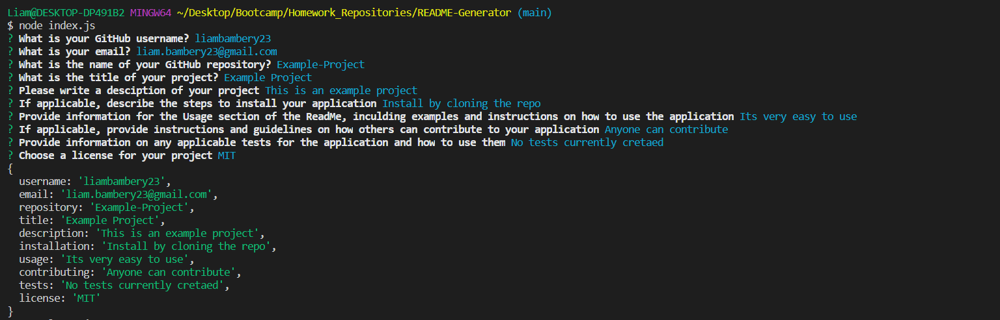

# README-Generator

## Description
This project is A README Generator that uses Node.JS in the command line to generate a functioning README file for a user based on a variety of prompts.

## Motivation
I created this project to simplify the Readme writting process for users so that they can devote more time to development of their project.

## Installation
To develop this project further you can clone the repsitory here [https://github.com/liambambery23/README-Generator](https://github.com/liambambery23/README-Generator)

## Usage
To use this application type 'node index.js' in the terminal. This will initiate the application and present you with a variety of questions. Your answers to these questions will then be used to generate a professional readme. 

Below is a link to a video demonstrating how to use this application:

[Walkthrough Video](https://drive.google.com/file/d/11-49bQHYiqt7Gjj1KwSxzVUWz9NU6_l9/view?usp=sharing)

Here is an image of what users can expect to see in the terminal

## Questions

If you have any questions regarding this application or would like to get in contact with me, please find my email below.

liam.bambery23@gmail.com

